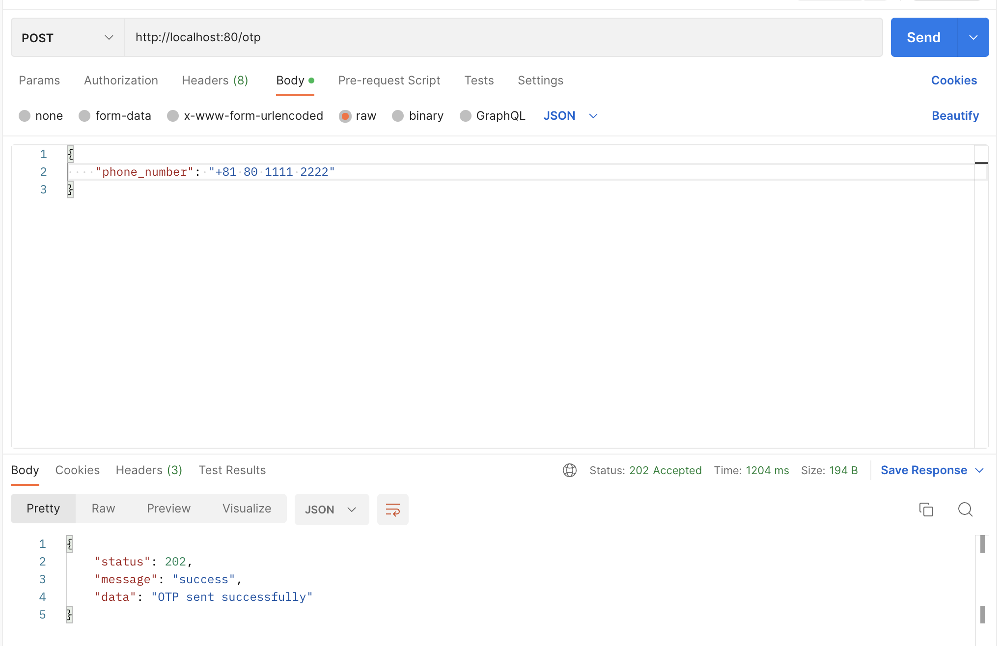

# go-sms-verification

# Module 
- gin
- twilio-go
- godotenv
- go-playground/validator/v10-> struct, fieldsを検証

# Example Request

# Gif

# Ref
- https://dev.to/hackmamba/how-to-build-a-one-time-passwordotp-verification-api-with-go-and-twilio-3363
- https://www.twilio.com/ja/
